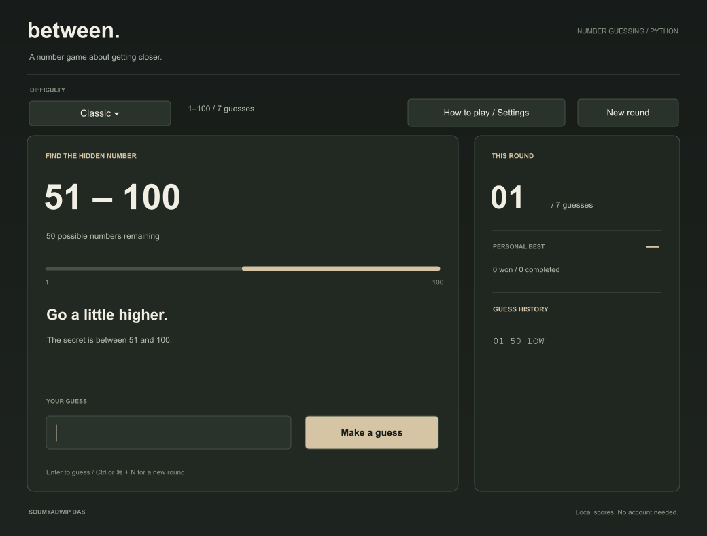

# Between

A number game about getting closer. Built with Python and Tkinter by **Soumyadwip Das**, Brainware University.



Choose a number, read the clue, and watch the possible range shrink. Between turns a small programming exercise into a complete desktop experience with keyboard controls, local records, and a calm, neutral interface.

## Play

Use **Python 3.10 or newer** with Tkinter. Python 3.12 is a good starting point. The game has no third-party runtime dependencies.

1. Download this repository's ZIP and extract it, or clone the repository.
2. Open the extracted `between` folder in VS Code.
3. Open **Terminal → New Terminal**.
4. Check that Tkinter works, then start the game:

```bash
python -m tkinter
python main.py
```

On macOS and Linux, use `python3` if that is the name of your Python 3 installation. Close the small Tk test window before launching the game.

Get a current Python installer from [python.org](https://www.python.org/downloads/). Official Windows and macOS Python installers provide Tkinter. On Debian/Ubuntu, a missing Tkinter module usually requires `sudo apt install python3-tk`. See [Python's Tkinter documentation](https://docs.python.org/3/library/tkinter.html).

**Desktop downloads:** the included release workflow builds platform-specific ZIPs. These are available only after a successful workflow run; this source repository does not include a prebuilt executable. GitHub Pages cannot directly run this Tkinter desktop interface.

## The game

| Mode | Number range | Valid guesses |
|---|---:|---:|
| Easy | 1–50 | 6 |
| Classic | 1–100 | 7 |
| Expert | 1–1,000 | 10 |

- **LOW** means the secret is higher. **HIGH** means it is lower.
- The range meter remembers what your clues have ruled out.
- Invalid, repeated, or already ruled-out numbers do not cost a turn.
- Guess correctly on the last available turn and you still win.
- Starting a new round partway through asks for confirmation. Abandoned rounds do not affect scores.
- Each difficulty has its own best score, win count, and completed-round count.
- Animations can be disabled. Optional system sounds start turned off.

Try choosing the middle of the remaining range. That strategy can solve every secret within each mode's turn limit. The program does not select guesses for you.


*The images use the same board renderer as the application, with illustrated native input controls. They are app-rendered previews, not operating-system screenshots. The example fixes the secret at 73; normal play selects a random secret once per round.*

## Keyboard controls

| Action | Shortcut |
|---|---|
| Submit a guess | Enter while the number field is focused |
| Start a new round | Ctrl+N, or Command+N on macOS |
| Open instructions and settings | F1 |
| Move between controls | Tab / Shift+Tab |
| Close instructions | Escape |

The input, buttons, difficulty selector, and history use native Tk widgets. The custom Canvas range visualization is visual rather than screen-reader labelled; full assistive-technology support is a future improvement.

## What the code demonstrates

The rules stay in a small Python class, separate from the interface and storage. This makes the game easy to test without a window.

```text
main.py                 Launch the desktop app
between/
  game.py               Random secret, validation, clues, and win/loss rules
  app.py                Widgets, events, keyboard controls, and animation
  theme.py              Shared palette and game-board rendering
  storage.py            Validated local settings and atomic score saves
tests/                  Automated rule and storage tests
tools/ui_smoke.py        Native desktop interaction checks
tools/render_preview.py Reproducible README preview renderer
.github/workflows/      Test matrix and desktop build/release workflows
```

Start with `between/game.py` when learning the project. It uses variables, conditions, loops, functions, and small dataclasses. `app.py` adds event-driven programming: a button calls a function, the game updates, and the window redraws. Tk's `after()` schedules short animation frames without blocking the interface.

## Tests

```bash
python -m unittest discover -s tests -v
```

The 21 tests cover valid and invalid guesses, duplicates, both range endpoints, first- and last-turn wins, losses, a fixed demonstration session, storage recovery, and failed saves. One test exhaustively checks the midpoint strategy against all **1,150 possible secrets** across the three modes.

With a working desktop/Tk installation:

```bash
python tools/ui_smoke.py
```

On a headless Linux machine:

```bash
xvfb-run -a python tools/ui_smoke.py
```

The test workflow runs the rule and storage tests on Windows, macOS, and Linux across Python 3.10, 3.12, and 3.13. A separate Linux job exercises the native Tk interface under a virtual display. These workflow configurations are not claims that remote runs have already passed.

## Local data

The game does not need a login, send analytics, or make network requests. Scores and settings are saved locally:

- Windows: `%LOCALAPPDATA%/Between/progress.json`
- macOS: `~/Library/Application Support/Between/progress.json`
- Linux: `$XDG_DATA_HOME/Between/progress.json`, or `~/.local/share/Between/progress.json`

If progress cannot be read, the game starts with default records and displays a message. If saving fails, play can continue with in-memory scores. Files are replaced atomically to reduce the chance of a partially written save.

## Build a desktop download

Build on the operating system you intend to distribute for. A Windows build cannot be produced simply by running PyInstaller on macOS.

```bash
python -m venv .venv
# Windows: .venv\Scripts\activate
# macOS / Linux: source .venv/bin/activate
python -m pip install -r requirements-dev.txt
python -m PyInstaller --noconfirm --clean --windowed --name Between --collect-submodules between main.py
python tools/package_release.py
```

The ZIP appears in `release/`. Extract the entire archive before launching it. The workflow creates unsigned builds; code signing and installer packaging remain future work. See [PyInstaller's platform notes](https://pyinstaller.org/en/stable/operating-mode.html).

On GitHub, run **Actions → Build desktop downloads → Run workflow** to produce downloadable build artifacts. Pushing a version tag such as `v1.0.0` runs the builds and then creates a GitHub release with the archives. The publication job only runs for tags.

## Next steps

Possible future additions include a daily challenge, a practice mode that explains midpoint guessing, a browser edition, and more accessible descriptions of the range meter. The current release is a local desktop game with no online leaderboard or multiplayer.

## License

[MIT](LICENSE). Created by Soumyadwip Das.
